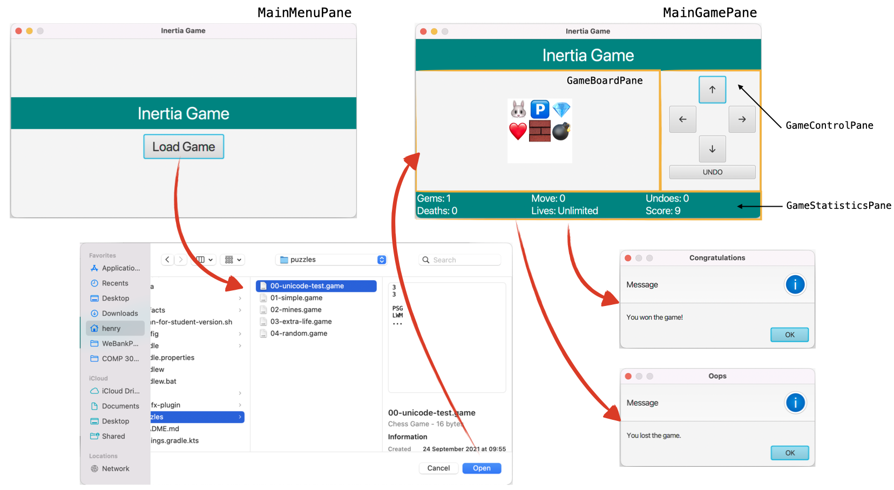

# COMP3021 PA2: Inertia Java FX Game

In PA2, the reference implementation of PA1 will be provided and your tasks are basically to implement a GUI view of
the game based on the skeleton code provided by us.
The information provided in PA1 will not be repeated in this README. 
You may check out [this link](https://github.com/CastleLab/COMP3021-2021Fall-PA1-Student-Version) if you want to revisit that.

## User Story

In this part, you will learn how the game will be played by the user.
- First, the user runs the game and sees the main menu, which contains the name of the game and a button for loading 
  the game from a file.
- Then the user clicks on the [Load Game] button and an open file dialog will show up to prompt the user to choose a saved game file.
  - If the user clicks on the [Cancel] button of the dialog, an alert showing that the user has cancelled selecting a
    file will pop up.
  - If the there is an error loading the file selected by the user, an alert showing that there is an error when loading
    the game file will pop up.
- If the game file is loaded successfully, the user will be navigated to the game play interface, which consists of 
  three areas: the game board showing the status of the game, the control area for operating the game, and the statistics
  panel showing the numeric information.
- Then the user clicks on the buttons in the control area to play the game.
- If the user wins or loses the game, the corresponding alert will be shown
- The user will be navigated back to the main menu after the alert is closed.

## GUI Components and Classes

In this assignment, the major components and classes are in the package `hk.ust.cse.comp3021.pa2.views`.
- The `GameBoardPane`: A class inherited form `GridPane`. It displays the whole by showing the content of each cell in
  its rows and columns.
- The `GameControlPane`: A class inherited from `GridPane`. It displays four buttons for moving the play of the game
  left, up, right, and down. And there is another button for undoing the move.
- The `GameStatisticsPane`: A class inherited from `GridPane`. It displays the statistical information fo the game similar
  to that in PA1, including the number of gems, moves, undoes, deaths, and lives, as wells the current score.
- The `GameCell`: A class inherited from `ImageView`. It displays an image based on the type of the cell.

## Tasks

Complete all the TODOs in the entire project. A detailed description of each task is provided in the Javadoc above each
method. In IntelliJ IDEA, go to View > Tool Windows > TODO to jump to each TODO in the project. You may replace the
placeholder implementation in the methods marked as `TODO`.

For some methods that returns a value but need you to complete, we put a placeholder by throwing 
an `NotImplementedException` to make it compile, you should remove it when adding your implementation.

### IntelliJ IDEA

When testing your own implementation, you may use the provided `Run App` Run Configuration.

### Code Style

Since this is a Java course, we expect you to write idiomatic Java with a good code style. As such, we employ the tool
[CheckStyle](https://checkstyle.sourceforge.io/) to help you check the style of your implemented code.

You may use the [CheckStyle Run Configuration](#intellij-run-configurations) to run CheckStyle on your code. The report
will be generated in `app/build/reports/checkstyle`.

Note that a good code style is part of the grading scheme.

## IntelliJ Run Configurations

To help you with the different tasks offered by Gradle, we have bundled some run configurations for you in IntelliJ, so
that you can just choose what you want to run.

- Run App: Runs the GUI application `hk.ust.cse.comp3021.pa2.Main`.
- Sanity Test: Runs all sanity tests. All the test cases in PA1 will become sanity tests of PA2. 
- CheckStyle: Runs CheckStyle, which catches any suboptimal Java practices used in your implementation.
- Javadoc: Generates Java documentation in HTML format. The documentation will be outputted in `app/build/docs`.
- Clean: Cleans any build files generated by Gradle.
- JAR: Creates a JAR of your project.

Note that for testing, there is an option for Gradle and an option for JUnit. While usually we would use the Gradle 
version, a bug in IntelliJ causes the test panel to not show up when testing using Gradle. Therefore, we suggest using
the JUnit version of the test configurations instead.

## Submission

You should submit a ZIP file containing the following:

- This Java project. Please keep the original file structure.
- A `github-url.txt` file containing the URL of your private repository. We will ask you to add the TAs' accounts as
  collaborators soon.

You need to submit your ZIP file to [CASS](https://cssystem.cse.ust.hk/UGuides/cass/index.html). The deadline for 
this assignment is **November 8th 2021, 23:59**.

## Grading Scheme

|  | **Percentage** | **Notes** |
| --- | --- | --- |
| Keep your GitHub repository private | 5% | You must keep your repository **private** at all times. |
| Commit at least 3 times in different days | 5% | You should commit three times during different days in your repository. |
| Code Style | 10% | You get 10% by default, and every 5 warnings from CheckStyle deducts 1%. |
| Project Demonstration | 80% | Will release later |

Note that sanity tests are not part of the marking scheme because they are to make sure the critical part of the skeleton code is working.
They will pass even you have not implemented anything. 
**You will get zero for the both the provided and hidden test part (counted for 80%) if you break any of the sanity tests, which means you will get at most 20% for this assignment.**

### Plagiarism

We trust that you are familiar with HKUST's Honor Code. If not, refer to 
[this page](https://course.cse.ust.hk/comp3021/#honorcode).

